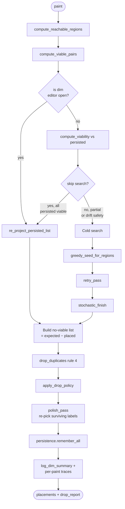
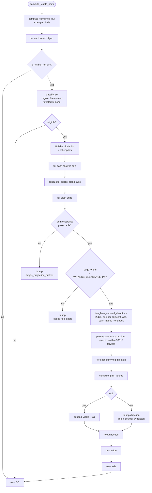
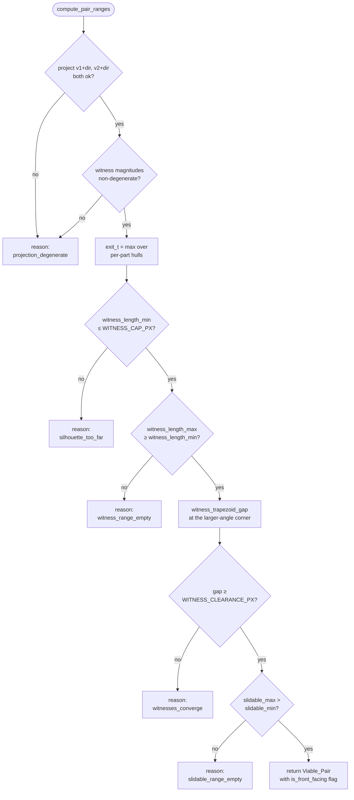
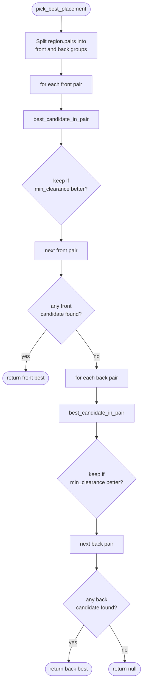
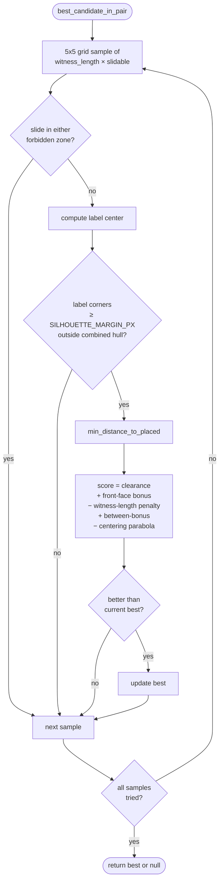
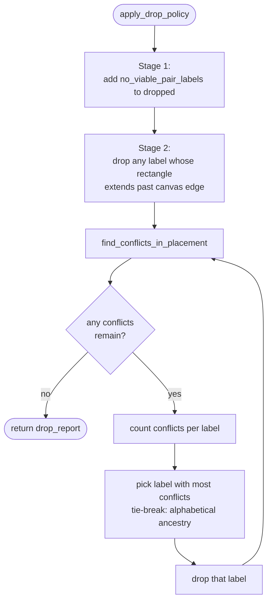
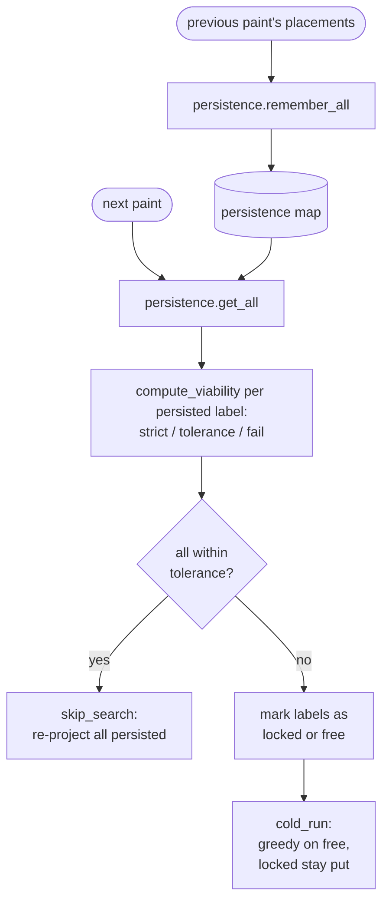

# Dimension placement — current code flow

How `run_new_placement` in `src/lib/ts/render/Dimension_Placement.ts` turns a scene into a list of placed dimensions, paint by paint. Every box on the diagram maps to a real function in that file.

## High-level

## Inside compute_viable_pairs

For every visible smart object, every axis allowed by the repeater filter, every silhouette edge along that axis, every adjacent-face direction.

## Inside compute_pair_ranges (one edge + one direction)

Returns `{ok: true, pair}` or `{ok: false, reason}`. Reasons feed the diagnostic counters.

## Inside pick_best_placement (per part-axis greedy step)

Hard front-face preference: try all front-facing pairs first; fall back to back-facing only if no front-facing pair yields a viable candidate.

## Inside best_candidate_in_pair (one pair, 5x5 grid sample)

Walks a 5x5 grid of (witness_length, slidable_position) values within the pair's ranges. Skips forbidden zones around each witness anchor and any candidate whose label rectangle is inside the combined silhouette outline. Scores the rest and returns the highest-scoring candidate.

## Inside apply_drop_policy

Three drop reasons, applied in order. The iterative third pass picks the label with the most conflicts each iteration.

## Persistence flow across paints

Each paint's placements feed the next paint's `compute_viability`.

