# Facet Pipeline

```mermaid
graph TD
    subgraph "Input"
        OBJ[Objects with vertices, edges, faces]
        CAM[Camera: eye, center, up]
    end

    subgraph "Render.ts — projection"
        PROJ[Project vertices to screen]
        FRONT[Identify front-facing faces and edges]
        OCC[Build occluding face list with screen polygons]
        WORLD[Compute world matrices per object]
    end

    subgraph "Topology.ts — Pass 1: Visibility"
        P1A["Pass 1a: Intersection lines
        For each pair of front faces from different objects:
        intersect face planes in 3D, clip to both quads,
        project to screen, clip against occlusion.
        Output: visible parts tagged with source faces.
        Creates: pierce endpoints, cross endpoints.
        Builds: pierce_on_edge lookup."]

        P1B["Pass 1b: Edge visibility
        For each front edge of each object:
        clip against all occluding faces from other objects.
        Merge nearly-touching intervals.
        Filter fake slivers between adjacent non-silhouette faces.
        Uses pierce_on_edge to reuse pierce keys at edge boundaries.
        Creates: corner endpoints, cross endpoints.
        ⚠ BUG: find_pierce matches wrong point when
        multiple points exist on same edge + same face."]

        P1E["Pass 1e: Split edge parts at pierce points
        For each unoccluded intersection line endpoint
        that sits on an edge (on_edge data):
        split the edge's visible interval at that point.
        Edge adopts the pierce key."]

        P1D["Pass 1d: Harvest face-boundary crossings
        For each visible edge, test against each other
        object's face polygon in 2D screen space.
        Depth check: edge must be in front.
        Stores anonymous crossing data for Pass 3."]
    end

    subgraph "Topology.ts — Pass 2: Knots at Depth"
        P2A["Pass 2a: Find all screen crossings
        For each pair of visible parts from different objects:
        compute 2D line intersection.
        Record crossing with screen and world positions."]

        P2B["Pass 2b: Create crossing endpoints
        One cross endpoint per crossing.
        Key: cross:edgeA:edgeB (canonical order)."]

        P2C["Pass 2c-d: Split all segments
        Split edge and intersection segments
        at crossing points."]

        P2E["Pass 2e: Depth classification
        At each crossing, determine which part is in front.
        Create occluding segments connecting
        consecutive crossings on same front-edge + behind-face."]
    end

    subgraph "Topology.ts — Pass 3: Label"
        P3A["Pass 3a: Identify endpoints from source tags
        Corner if near vertex.
        Cross if from arrangement split.
        Pierce if unoccluded intersection endpoint."]

        P3V["Pass 3: Pierce at vertex = corner merge
        If intersection line endpoint lands on a mesh vertex,
        merge pierce key to corner key."]

        P3P["Pass 3: Propagate key rewrites
        Apply all collected rewrites to edge segments,
        intersection segments, and pierce_edge_map."]

        P3G["Pass 3g: Face-boundary occluding segments
        Match anonymous crossing data from Pass 1d
        to pierce endpoints on face boundary edges.
        ⚠ find_pierce_any_boundary uses screen distance
        when boundary edge index is unknown (-1).
        ⚠ Rejects segments where enter and leave
        are on different boundary edges."]
    end

    subgraph "Facets.ts — Ingestion"
        IMP_EP[Import endpoints into graph]
        IMP_EDGE["Import edge segments
        Assigned to all front-facing faces
        that contain the edge."]
        IMP_IX["Import intersection segments
        Assigned to BOTH objects' faces."]
        IMP_XF["Import cross-face edge segments
        Dihedral test: skip edges where both adjacent
        source faces are front-facing (interior to source).
        Relaxed rule: one endpoint connected + one shared.
        At least one endpoint must have a segment
        on the target face."]
        IMP_OCC["Import occluding segments
        Type 'crossing'. Assigned to specific face."]
    end

    subgraph "Facets.ts — Trace"
        ORDER["Compute cyclic ordering
        at each endpoint for clockwise traversal"]
        TRACE["Trace closed facets per face
        Start from edge-type segment.
        At each endpoint, pick next clockwise segment.
        SO check: reject other-object corners
        unless they have segments on this face."]
    end

    subgraph "Facets.ts — Paint"
        PAINT["Paint facets
        Clip to face screen polygon.
        Fill each facet polygon."]
    end

    OBJ --> PROJ
    CAM --> PROJ
    PROJ --> FRONT
    FRONT --> OCC
    OBJ --> WORLD

    OCC --> P1A
    FRONT --> P1A
    P1A --> P1B
    P1B --> P1E
    P1E --> P1D

    P1D --> P2A
    P1A --> P2A
    P1B --> P2A
    P2A --> P2B
    P2B --> P2C
    P2C --> P2E

    P2E --> P3A
    P3A --> P3V
    P3V --> P3P
    P3P --> P3G

    P3G --> IMP_EP
    IMP_EP --> IMP_EDGE
    IMP_EDGE --> IMP_IX
    IMP_IX --> IMP_XF
    IMP_XF --> IMP_OCC

    IMP_OCC --> ORDER
    ORDER --> TRACE
    TRACE --> PAINT
```

## Endpoint types

| Type | Key format | Created by | Meaning |
|------|-----------|------------|---------|
| corner | `c:object:vertex` | Pass 1b, Pass 3a | Mesh vertex |
| pierce | `pierce:edge:face` | Pass 1a, Pass 3a | Line goes through a face's interior |
| cross | `cross:edgeA:edgeB` | Pass 1b, Pass 2b, Pass 3g | Two lines from different objects meet on screen |

## Key data flows

- **pierce_on_edge**: Built by Pass 1a, used by Pass 1b to reuse pierce keys at edge boundaries
- **face_boundary_crossings**: Built by Pass 1d, used by Pass 3g to create occluding segments
- **key_rewrites**: Built by Pass 3 merges, propagated by Pass 3p
- **cross-face segments**: Built by Facets ingestion, uses dihedral test to filter

## Known issues (marked with ⚠ in diagram)

1. **Pass 1b find_pierce**: Matches by edge + face only, not by position. Returns wrong point when multiple pierce/cross points exist on the same edge involving the same face.
2. **Pass 3g find_pierce_any_boundary**: Uses screen-distance test (proximity) when boundary edge is unknown. Would prefer a structural test.
