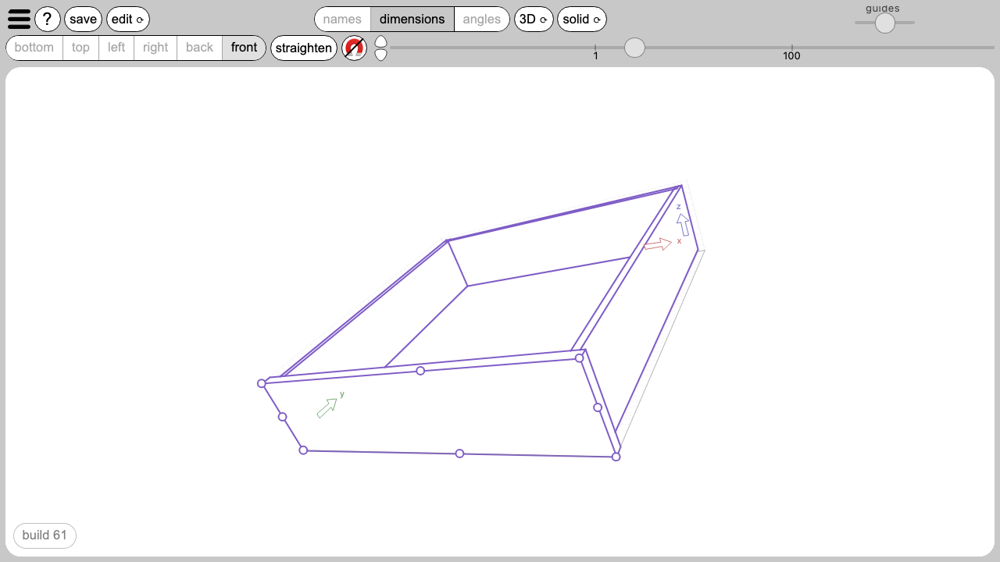
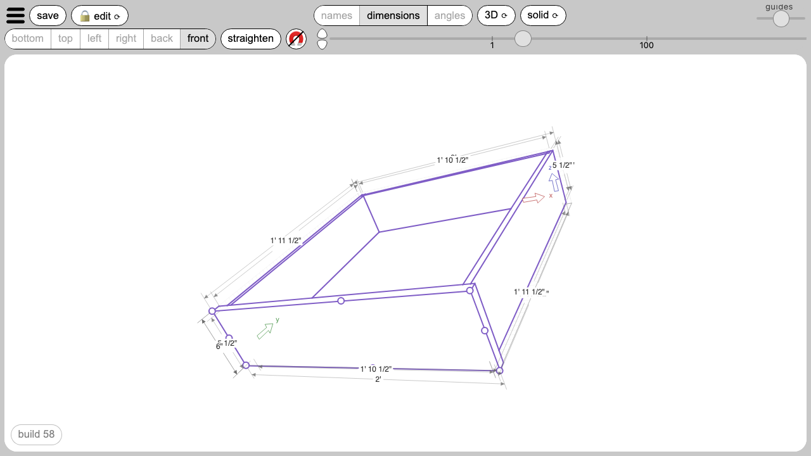
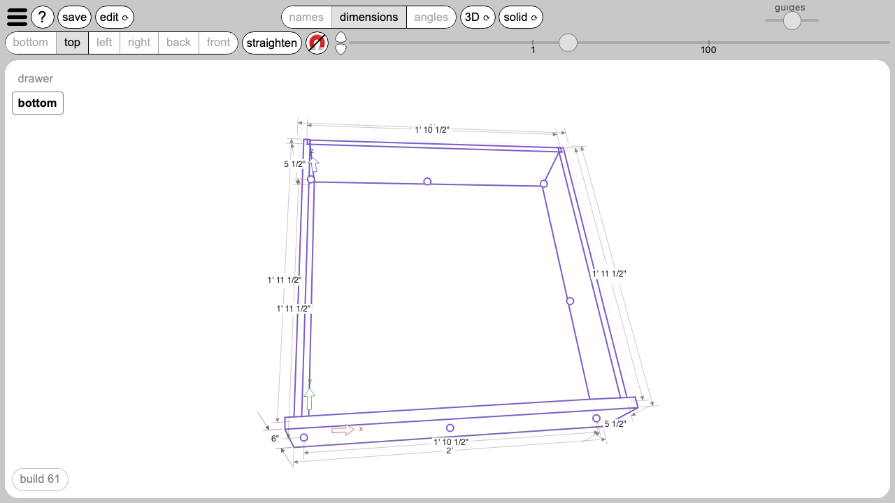
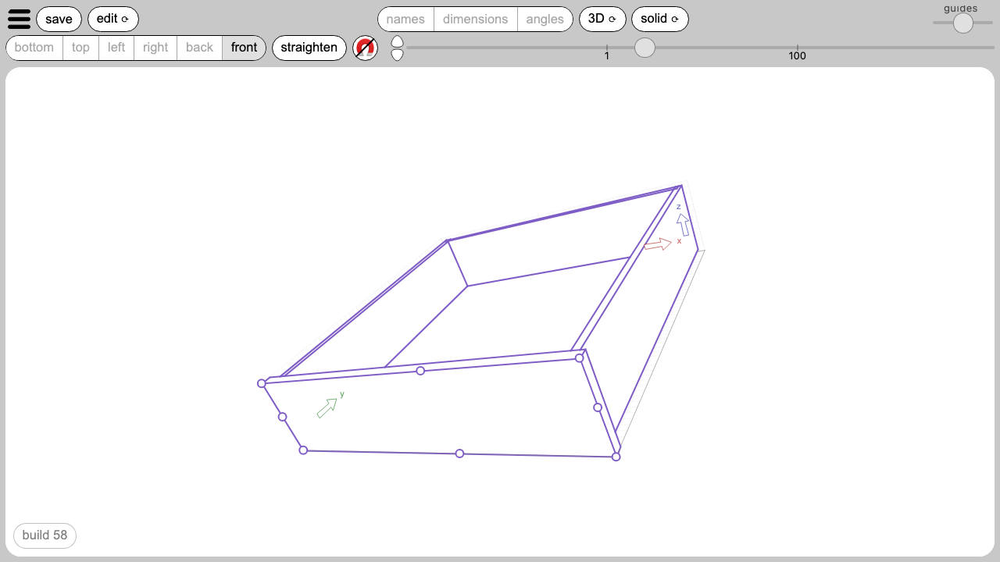
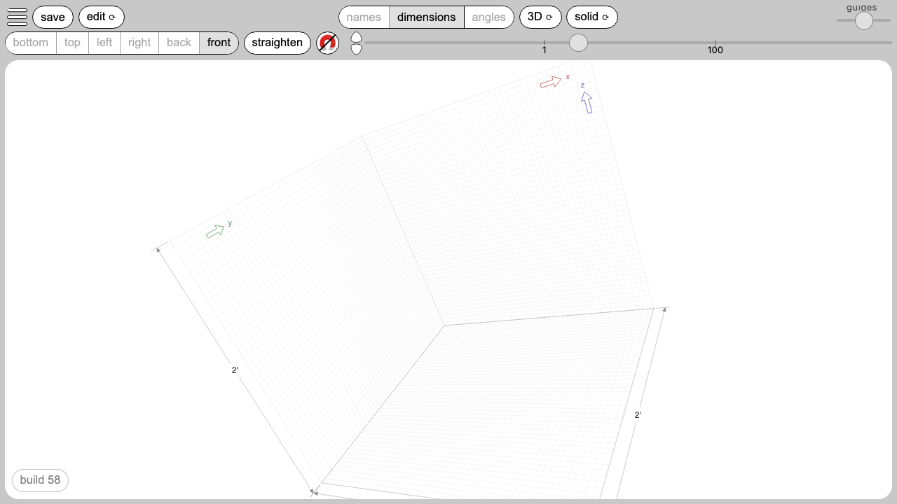
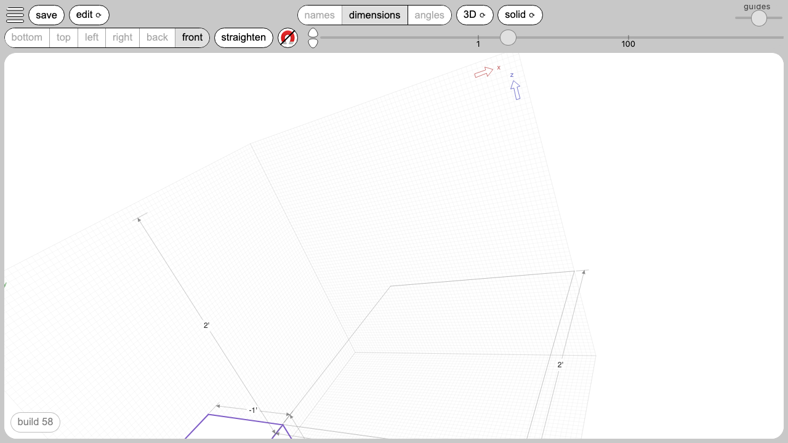

# First steps

A walk-through of your first few minutes with the app. Each step describes what you do and what you see; the citations name the code that makes the step happen.

## The URL

Open your browser and go to `designintuition.app`. The page loads in a few seconds; the app runs entirely in the browser.

Citation: the deployment is documented in `notes/work/milestones/done/3.docs.md`.

## The first drawing — a drawer

*The drawer fresh from the bundled default, with the side panel on the right.*

When you first open the app, the drawing surface shows a drawer. The view is tilted so all three dimensions are visible. The toolbar runs across the top; the side panel sits on the right with three folding sections (preferences, library, parts).

If you have used the app before, you see whatever you were last working on instead — the app saves automatically.

Citation: the bundled default file lives at `src/assets/cabinetry/drawer.di`. The load path is at `src/lib/ts/managers/Scenes.ts` lines 31-51 — the saved scene is read first, with the bundled drawer as the fallback when no saved scene exists.

### Showing dimensionals

*Three small numbers floating beside three of the drawer's edges.*

In the toolbar, the segmented control near the centre has three buttons — names, dimensions, angles. Click "dimensions". Three small numbers appear beside three of the drawer's edges, one for each axis. The numbers are formatted in your chosen unit family (imperial by default).

Citation: the toggle is wired at `src/lib/svelte/main/Controls.svelte` line 70.

### Trying to stretch — the lock

*A grab-hand cursor hovering near a corner — nothing moves while editing is locked.*

Click any visible face of the drawer, then try to drag a corner of that face. Nothing happens. The cursor stays as a "grab" hand the whole time. The app starts in a read-only mode — every part is locked against editing so you can look at the drawing without accidentally distorting it.

Citation: the read-only branch is at `src/lib/ts/events/Events_3D.ts` lines 80-84 — when the editing flag is off, no drag target is set and no hover lands.

### Turning on editing

*A close-up of the toolbar's edit button showing the padlock icon.*

In the toolbar, find the button labelled "🔒 edit". The closed padlock means editing is off. Click it. The padlock disappears; the button now reads "edit" with no padlock. Editing is on. Click it again to lock back.

Citation: the toggle is wired at `src/lib/svelte/main/Controls.svelte` line 51.

### Stretching the drawer

*Mid-drag — the drawer corner pulled to a new size.*

With editing on, click any visible face of the drawer to select it. Small dots appear at its corners and along its edges. Now drag any corner — the drawer stretches in the two directions on the selected face. Drag any edge — the drawer stretches in one direction. Drag the face's interior — the drawer slides in the plane of the face.

Citation: the drag handler is at `src/lib/ts/editors/Drag.ts` lines 304-355 — the editing branch picks face-drag, edge-drag, or corner-drag based on what was clicked.

### Editing a dimensional

*The dimension input overlaid on the drawer, ready for a new value.*

With dimensions showing and editing on, click any one of the three small numbers. A text input appears in place of the number, with the current value selected. Type a new value — for example `2'`, `60 cm`, or `1 1/2"` — and press Enter. The drawer resizes to the new dimension. Press Escape during editing to cancel.

Citation: the dimension editor's begin-and-commit lifecycle is at `src/lib/ts/editors/Dimension.ts` lines 41-114.

## Creating a new design

*A blank drawing surface — the new scene's root is invisible by default.*

To start something brand new, find the library section in the side panel. The section header has a small plus button at the right. Click it. The current scene is replaced; the drawing surface goes blank. The parts panel shows a single row for the new root part — invisible by default — ready for you to fill in.

Citation: the plus button is wired at `src/lib/svelte/details/Details.svelte` line 44 — it calls a helper that creates a fresh scene with one default-sized invisible part. The fresh-scene helper is at `src/lib/ts/managers/Scenes.ts` lines 300-314.

### Adding an empty box

*The drawing surface after a new child part has been added inside the root.*

Click the plus button at the right of the parts section header. A new part is added inside the currently-selected part (or as a child of the root, if nothing is selected). The new part is given a default size and lands inside its parent. With the new part visible and selected, you can stretch it, rename it, type formulas into its attribute cells, and add children of its own.

Citation: the parts plus button is wired at `src/lib/svelte/details/Details.svelte` line 51 — it calls the engine's add-child helper.

## What to read next

- [Selection](./reference guide/selection.md) — multi-select with command-click, drill-down through stacks.
- [Formulas](./reference guide/formulas.md) — what you can type in a formula cell.
- [Units](./reference guide/units.md) — choosing a unit family, precision, typing values.
- [Library](./reference guide/library.md) — saving, replacing, importing arrangements.
- [Repeaters](./reference guide/repeaters.md) — stairs, studs, joists.
